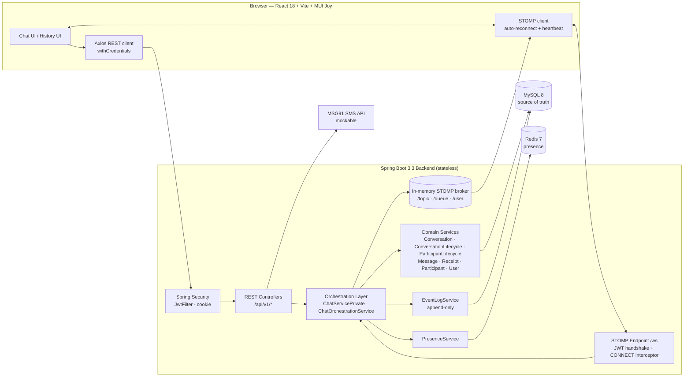
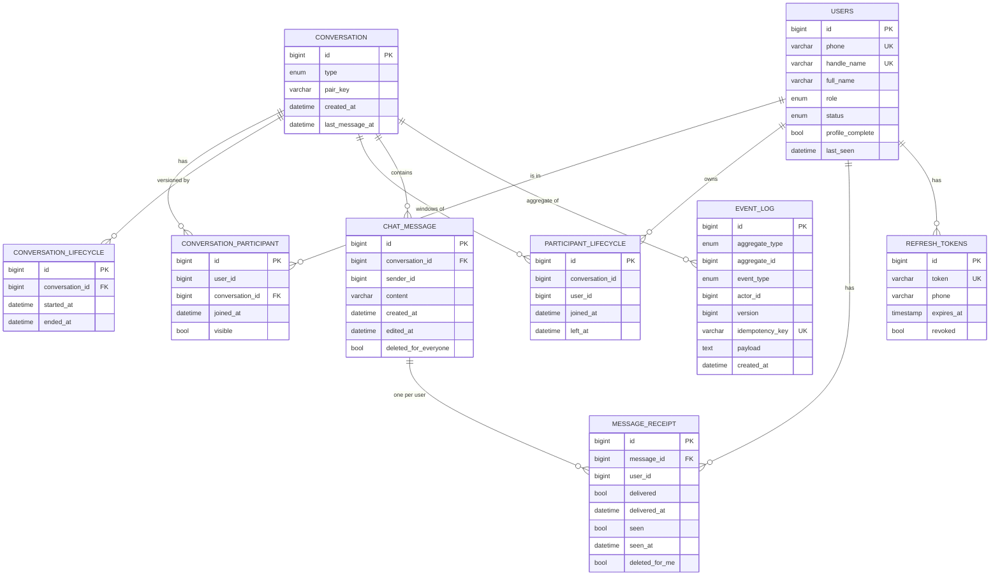
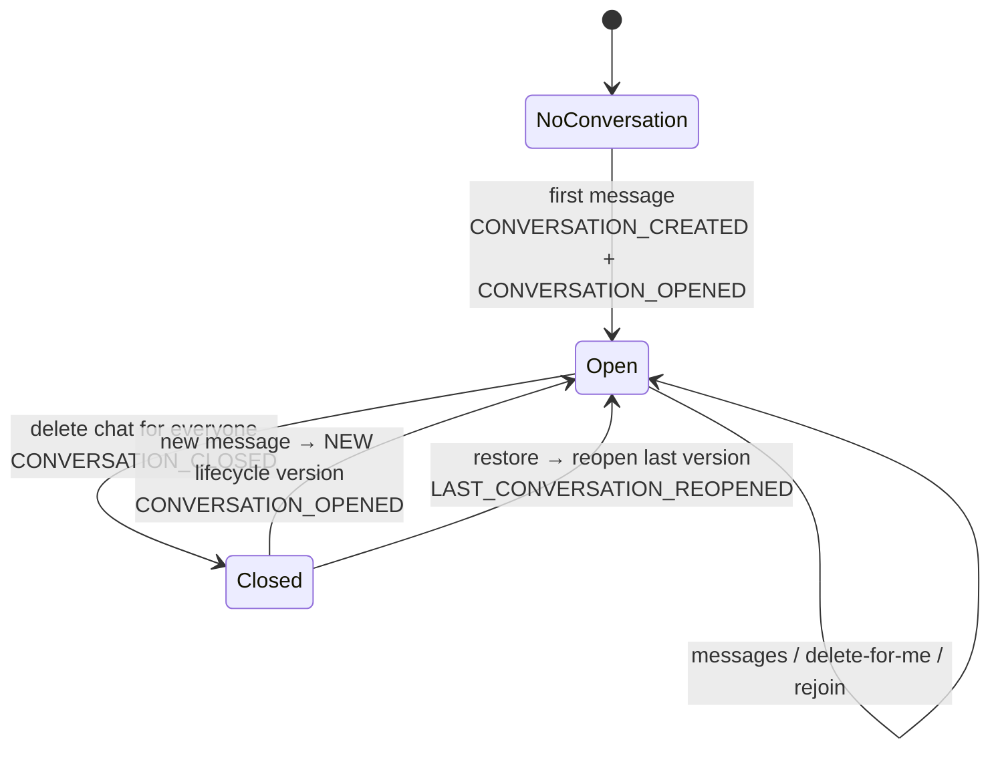
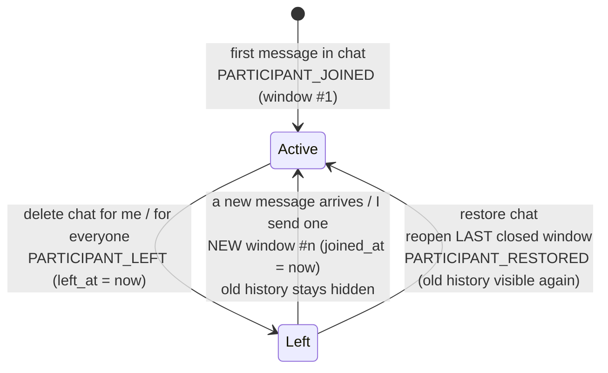
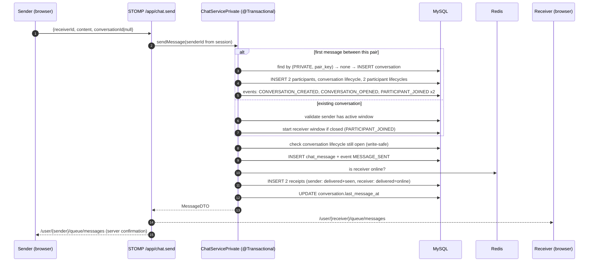
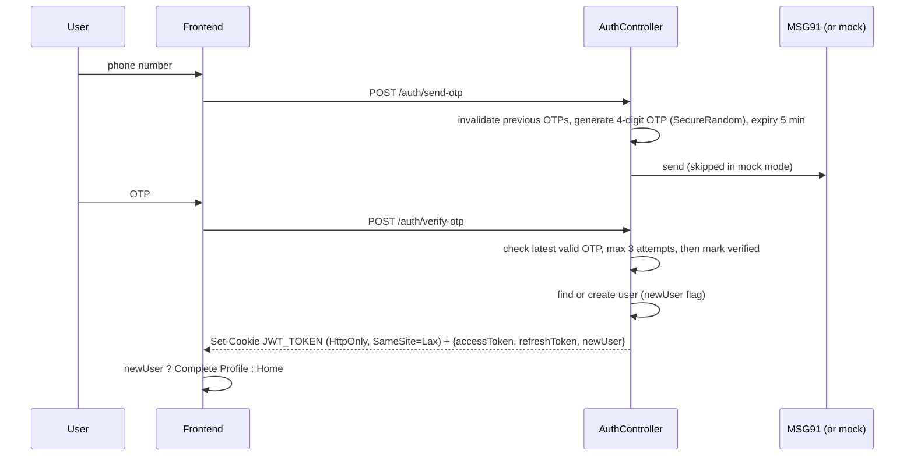
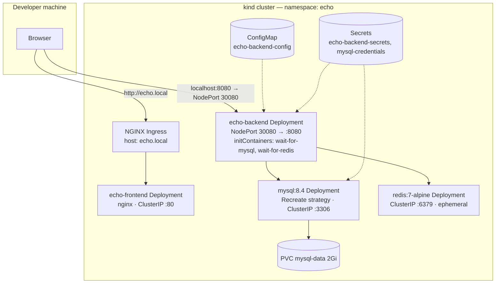
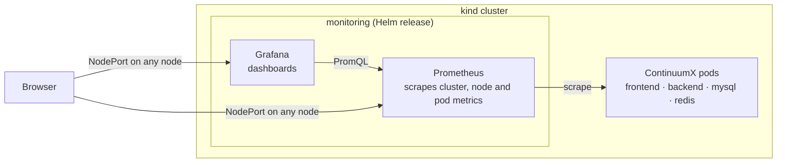
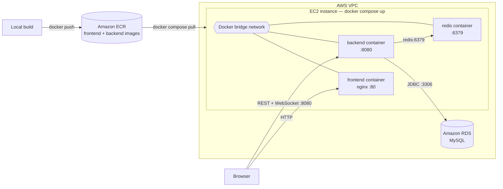

# ContinuumX — Lifecycle-Driven Real-Time Chat Platform

> A real-time 1-to-1 messaging platform where **participation is a time window, not a membership flag**.
> Every conversation and every participant carries a versioned lifecycle, and every state change is written to an append-only event log. This lets ContinuumX show users **read-only views of chats they deleted**, give **correct visibility on rejoin**, **restore** closed chats, and lays the groundwork for **rebuilding a conversation as it was at any point in time**.

         

**Type:** Solo project. Idea, domain model, architecture, optimisations, and deployment were designed and built end to end by me.
**Naming:** the project was earlier called *Echo*, so Docker images, the Kubernetes namespace and some internal names still use `echo`.
**Status:** Fully working; deployment tested on **Kubernetes (kind)** with **Prometheus + Grafana** monitoring, and on **AWS (EC2 + ECR + RDS)** with Docker Compose. Not publicly hosted.

---

## Table of Contents

1. [The Problem](#1-the-problem)
2. [The Core Idea](#2-the-core-idea)
3. [What Makes ContinuumX Different](#3-what-makes-continuumx-different)
4. [Feature List](#4-feature-list)
5. [Architecture](#5-architecture)
6. [Domain Model & Database Design](#6-domain-model--database-design)
7. [Lifecycle Engine — How It Works](#7-lifecycle-engine--how-it-works)
8. [Append-Only Event Log](#8-append-only-event-log)
9. [Key Flows](#9-key-flows)
10. [Real-Time Layer (WebSocket / STOMP)](#10-real-time-layer-websocket--stomp)
11. [Presence System (Redis)](#11-presence-system-redis)
12. [Authentication & Security](#12-authentication--security)
13. [Non-Functional Requirements](#13-non-functional-requirements)
14. [API Reference](#14-api-reference)
15. [Frontend](#15-frontend)
16. [Tech Stack & Why](#16-tech-stack--why)
17. [Project Structure](#17-project-structure)
18. [Configuration](#18-configuration)
19. [Running Locally](#19-running-locally)
20. [CI/CD](#20-cicd)
21. [Deployment](#21-deployment)
22. [Design Decisions & Trade-offs](#22-design-decisions--trade-offs)
23. [Known Limitations & Issues](#23-known-limitations--issues)
24. [Roadmap](#24-roadmap)
25. [Project Facts (Quick Reference)](#25-project-facts-quick-reference)

---

## 1. The Problem

Most chat systems answer one question when a user opens a conversation:

> *Is this user a member of this conversation?*

A yes/no membership flag can't handle the cases real users run into:

| Situation | Membership flag gives | What should happen |
|---|---|---|
| User deletes a chat, then the other person messages again | All old messages come back, or the chat is gone for good | A **fresh** chat with only new messages; old ones stay hidden |
| User wants to look at a chat they deleted | Gone | A **read-only** view of that old chat |
| Both users delete a chat "for everyone", then start talking again | Same conversation row, mixed history | A **new version** of the conversation |
| User deleted a chat by mistake | Unrecoverable | **Restore** the last closed chat |
| Auditing / rebuilding what a chat looked like last week | Not possible | Rebuild from an **event history** |

## 2. The Core Idea

ContinuumX replaces the membership flag with this question:

> *Was this user participating **when this message was sent**?*

Participation is stored as a series of **time windows** (`joined_at` → `left_at`). A message is visible to a user only if it falls inside one of that user's windows:

```sql
message.created_at >= participant_lifecycle.joined_at
AND (participant_lifecycle.left_at IS NULL OR message.created_at <= participant_lifecycle.left_at)
AND message_receipt.deleted_for_me = false
```

There are two kinds of lifecycle:

| Lifecycle | Question it answers | Scope |
|---|---|---|
| **ConversationLifecycle** | *Is this conversation open right now, and what versions has it had?* | One per conversation version |
| **ParticipantLifecycle** | *Which window of messages can this user see?* | One per user per join |

Nothing is physically deleted. Messages, lifecycles, and receipts are kept, and every change is also recorded in an **append-only event log**.

## 3. What Makes ContinuumX Different

### 3.1 Fast, read-only access to deleted chats
When a user deletes a chat, their participant window is **closed, not erased**. The History view lets them browse:

```
Conversation versions (ConversationLifecycle)
   └── My participation windows inside that version (ParticipantLifecycle)
          └── Messages inside that window (read-only, paginated)
```

It stays fast because every history query is **bounded by the window** (`joined_at`/`left_at`) and the conversation id, uses a composite index, and pages by message id (keyset pagination, 30 per page). Messages outside the window are never scanned or loaded.

### 3.2 Append-only event log for point-in-time reconstruction
Every state change (message sent, edited, deleted for me or for everyone, conversation created/opened/closed/reopened, participant joined/left/restored) is written as an **immutable, versioned event** for the conversation aggregate. Events carry a per-aggregate version number, the actor, a JSON payload, and an idempotency key. The log is the base for **rebuilding a chat exactly as it was at any point in time** (event sourcing / replay). Edits store both `oldContent` and `newContent`, so the full edit history is kept even though the message row only holds the latest text.

### 3.3 Participant lifecycle drives chat versioning
- **Delete chat for me** closes only *my* window. The other user is not affected.
- **New message after I deleted the chat** opens a *new* window for me starting now, so I don't get the old history back automatically.
- **Restore** reopens my *last closed* window, which brings that history back.
- Each user's timeline is independent; nobody's action changes another user's visibility history.

### 3.4 Conversation lifecycle as the "is this chat open?" gate
- `ConversationLifecycle` is checked **before every message write** (a write-safe check inside the save transaction). If the chat was closed while a message was in flight, the write is rejected.
- **Delete chat for everyone** ends the current conversation lifecycle and both participant windows. The next message starts a **new conversation version**, so conversations are versioned over time.
- **Private chats:** it defines what happens when a chat is closed, reopened, or restored.
- **Groups (planned):** the same lifecycle becomes a cheap, indexed existence check ("does this group exist and is it open?") before any group operation. Groups get that check without adding new tables.

---

## 4. Feature List

### Messaging
- One-to-one private messaging in real time over **WebSocket (STOMP)**.
- **Conversations are created lazily**: no conversation row exists until the first message is sent. The pair is deduplicated with a canonical `pair_key = min(userA,userB)_max(userA,userB)` and a `UNIQUE(type, pair_key)` constraint.
- Messages are echoed to **both** sender and receiver queues, so the sender's UI shows the server-confirmed message (real id and timestamps).
- **Delete message for me**: per-user, implemented as a flag on that user's receipt.
- **Delete message for everyone**: sender only; soft-deleted on the message and pushed live to both users. Tells the client if the deleted message was the conversation's **last message**, so the chat list preview updates correctly.
- **Edit message**: sender only; blocked on messages deleted for everyone; sets `edited_at`; full old/new content recorded in the event log. (Available in the backend API.)
- Message length up to 2000 characters.
- **Keyset (cursor) pagination**: newest 30 first, then older pages with `?offsetId=<oldest loaded id>`.

### Conversation management
- **Chat list** sorted by last activity, with: other user's handle, last message preview (or "Message deleted"), **unread count**, **online status**, and **last seen**.
- **Delete chat for me**: closes only my participant lifecycle.
- **Delete chat for everyone**: closes the conversation lifecycle and both participant lifecycles, and notifies the other user live (`CONVERSATION_DELETED`).
- **Restore chat**: when opening a new chat with someone, the app checks if a restorable closed chat exists (`restore-eligible`) and offers to restore it. Restore reopens the last closed participant lifecycle and, if needed, the last closed conversation lifecycle.

### Lifecycle history (time-travel)
- Browse **all versions** of a conversation (start and end time, active or not).
- Inside each version, list **my participation windows**.
- Open any window in a **read-only, paginated** message view ("You are viewing archived messages. This chat is read-only.").

### Receipts
- **Per-user receipt row for every message**, created **at send time** (eager): sender's receipt is created as delivered and seen; receiver's receipt is created as delivered if the receiver is online in Redis.
- **Delivered ticks**: on every (re)connect, the client calls `markBulkDelivery`. The server marks every pending receipt in the user's active windows as delivered in **one bulk UPDATE**, then pushes `MESSAGE_DELIVERED` to each sender.
- **Seen ticks**: opening a conversation runs **one bulk UPDATE** (seen and delivered, keeping the first delivered timestamp via `COALESCE`) and pushes `MESSAGE_SEEN` to the senders.
- Unread counts respect the lifecycle window, deleted-for-me, deleted-for-everyone, and exclude your own messages.

### Presence
- Online/offline through **Redis keys with a TTL** plus a client **heartbeat**.
- **Last seen** saved to MySQL on disconnect.
- Presence changes broadcast to everyone over `/topic/presence`.

### Authentication & accounts
- **Passwordless phone + OTP login** (Indian mobile number format validated).
- New users go through **Complete Profile** (full name + unique handle name).
- **JWT in an HttpOnly cookie**, plus **refresh tokens** stored server-side and revoked on logout.
- WebSocket connections are authenticated with the same JWT cookie during the handshake.

### Platform / operations
- Structured, tagged logs for every operation (`[SEND_PRIVATE_MESSAGE] sender=… receiver=…`) with rolling log files.
- Spring Boot **Actuator** health, info, and metrics endpoints; health is used by Kubernetes probes.
- Multi-stage **Docker** images, **GitHub Actions** CI/CD to Docker Hub, **Kubernetes** manifests (kind), **Prometheus + Grafana** installed with **Helm**, and an **AWS** deployment (EC2 + ECR + RDS, Docker Compose).

---

## 5. Architecture

### 5.1 High-level system



### 5.2 Layering

```
Controller layer      AuthController, ChatController, UserController, PresenceController,
                      WebSocketChatController (@MessageMapping)
        │
Orchestration layer   ChatServicePrivate        → send, delete chat, restore, history (private chats)
                      ChatOrchestrationService  → receipts, chat list, message delete/edit + WS fan-out
                      ChatQueryHelper           → message fetch + batch receipt mapping to DTOs
        │
Domain services       ConversationService, ConversationLifecycleService, ParticipantLifecycleService,
                      ConversationParticipantService, MessageService, MessageReceiptService,
                      EventLogService, PresenceService, UserService, OtpService, AuthService
        │
Repositories          Spring Data JPA (JPQL, bulk @Modifying updates, DTO projections, one native query)
        │
Storage               MySQL (all durable state) · Redis (ephemeral presence)
```

- **Packaged by domain** (`chat/conversation`, `chat/conversationLifecycle`, `chat/participantLifecycle`, `chat/message`, `chat/messageReceipt`, `eventLog`, `auth`, `user`, `websocket`, `config`). Each domain owns its entity, repository, and service.
- **Orchestrators** combine domain services inside one `@Transactional` boundary. Domain services don't call each other in circles.
- The `ConversationType` enum (`PRIVATE`, `GROUP`) and a separate `ChatServicePrivate` leave room for a parallel `ChatServiceGroup` without touching the private-chat logic.

---

## 6. Domain Model & Database Design

### 6.1 ER diagram



There's also `otp_records` (phone, 4-digit OTP, expiry, attempts, verified), indexed on `phone`.

### 6.2 Tables and why each exists

| Table | Purpose | Key design point |
|---|---|---|
| `users` | Account, profile, last seen | Phone is the login identity (JWT subject); handle name unique |
| `conversation` | Conversation identity | `UNIQUE(type, pair_key)` stops duplicate private chats under concurrency; `last_message_at` drives chat-list order |
| `conversation_participant` | Static "who belongs to this chat" | `UNIQUE(user_id, conversation_id)`; used to find the other user and for basic access checks |
| `conversation_lifecycle` | **Versions** of a conversation | `ended_at IS NULL` = open; index `(conversation_id, ended_at)` makes the "is it open" check an index lookup |
| `participant_lifecycle` | **Visibility windows** per user | Index `(conversation_id, user_id, left_at)` makes finding the active window an index lookup |
| `chat_message` | Message history (never physically deleted) | Composite index `(conversation_id, deleted_for_everyone, id)` serves conversation-scoped, id-ordered page reads |
| `message_receipt` | Per-user delivered / seen / deleted-for-me | `UNIQUE(message_id, user_id)`; indexes `(user_id, delivered)` and `(user_id, seen)` for the bulk receipt updates |
| `event_log` | Append-only audit / replay log | All columns `updatable=false`; index `(aggregate_type, aggregate_id, version)`; `UNIQUE(idempotency_key)` |
| `refresh_tokens` | Server-side refresh sessions | Revocable; 7-day expiry |
| `otp_records` | OTP challenges | Expiry, attempt counter, invalidation |

### 6.3 Indexes

| Index | Columns | Serves |
|---|---|---|
| `uk_private_pair` | `conversation(type, pair_key)` | Dedup and lookup of a private chat by user pair |
| `idx_conversation_pair_key` | `conversation(pair_key)` | Pair lookup |
| `idx_conversation_created_at` | `conversation(created_at)` | Time ordering |
| `idx_cl_active` | `conversation_lifecycle(conversation_id, ended_at)` | "Is this conversation open?" |
| `idx_cl_conversation` | `conversation_lifecycle(conversation_id)` | History listing |
| `idx_pl_active` | `participant_lifecycle(conversation_id, user_id, left_at)` | Active-window lookup, validation |
| `idx_pl_conv_user` | `participant_lifecycle(conversation_id, user_id)` | History windows |
| `idx_msg_conv_del_id` | `chat_message(conversation_id, deleted_for_everyone, id)` | Paged message reads, latest non-deleted message |
| `idx_msg_sender` | `chat_message(sender_id)` | Sender-owned edit and delete checks |
| `uk_message_user` | `message_receipt(message_id, user_id)` | One receipt per user per message; race safety |
| `idx_receipt_user_delivered` / `idx_receipt_user_seen` | `message_receipt(user_id, delivered/seen)` | Bulk delivered and seen updates |
| `idx_event_aggregate` | `event_log(aggregate_type, aggregate_id, version)` | Ordered replay per aggregate; latest version lookup |
| `uk_event_idempotency` | `event_log(idempotency_key)` | Duplicate event protection |
| `idx_user_phone` | `users(phone)` | Login, JWT → user resolution |
| `idx_otp_phone` | `otp_records(phone)` | Latest valid OTP lookup |

---

## 7. Lifecycle Engine — How It Works

### 7.1 State of a conversation



### 7.2 State of one participant



### 7.3 Example timeline

```
time ─────────────────────────────────────────────────────────────────────▶
Alice  [====== window #1 ======]x              [===== window #2 ==========
Bob    [==================== window #1 ===================================
msgs     m1  m2  m3                  m4  m5         m6  m7
                              ▲ Alice "delete chat for me"
                                               ▲ Bob sends m6 → Alice gets window #2
Alice sees now:        m6, m7          (m4/m5 were sent while she was out)
Alice History view:    window #1 → m1, m2, m3 (read-only)
Bob sees now:          m1 … m7         (Alice's action never touched Bob's timeline)
Alice "restore" instead of waiting: window #1 reopened → m1 … m5 visible again
```

### 7.4 Rules enforced in code

| Rule | Where |
|---|---|
| Can't write into a closed conversation (checked inside the save transaction) | `MessageService.savePrivateMessage` → `existsByConversationIdAndEndedAtIsNull` |
| Sender must have an active window to send into an existing conversation | `ParticipantLifecycleService.validateActiveParticipant` |
| Receiver gets a new window automatically if theirs is closed | `startIfNotExists(conversationId, receiverId)` |
| Only one active lifecycle is started per check (idempotent "start if not exists") | `ConversationLifecycleService.startIfNotExists`, `ParticipantLifecycleService.startIfNotExists` |
| Message reads limited to the active window | `findLastMessages` / `findOlderMessages` (`created_at >= joined_at`) |
| History reads limited to the chosen window `[joined_at, left_at]` | `findMessagesInsideWindow` / `findOlderMessagesInsideLifecycle` |
| History windows only returned for the requesting user | `findByConversationAndTimeWindow(..., userId)`, `findByIdAndUserId` |
| Delete for everyone: sender only, not already deleted, not already deleted-for-me | `ChatOrchestrationService.deleteMessageForEveryone` |
| Edit: sender only, not on deleted-for-everyone messages, no blank content | `ChatOrchestrationService.editMessage`, `MessageService.editMessage` |
| Restore only if no active window exists and a closed one does | `ChatServicePrivate.restoreLifecycle` |

---

## 8. Append-Only Event Log

Every change to a conversation also writes an event to `event_log`, **in the same transaction** as the change, so state and history can't drift apart.

| Field | Meaning |
|---|---|
| `aggregate_type` / `aggregate_id` | Which aggregate the event belongs to (currently `CONVERSATION` + conversation id) |
| `event_type` | One of the event types below |
| `actor_id` | User who caused the event |
| `version` | Per-aggregate sequence number (`MAX(version) + 1`) giving a total order for replay |
| `idempotency_key` | UUID with a unique constraint |
| `payload` | JSON (Jackson) with the event details |
| `created_at` | Server timestamp |

All columns are `updatable = false`; events are never changed after they're written.

**Event types:** `CONVERSATION_CREATED`, `CONVERSATION_OPENED`, `CONVERSATION_CLOSED`, `LAST_CONVERSATION_REOPENED`, `PARTICIPANT_JOINED`, `PARTICIPANT_LEFT`, `PARTICIPANT_RESTORED`, `MESSAGE_SENT`, `MESSAGE_EDITED`, `MESSAGE_DELETED_FOR_ME`, `MESSAGE_DELETED_FOR_EVERYONE` (plus a reserved `CONVERSATION_ENDED`).

**Example payloads:**
```json
// MESSAGE_SENT
{ "messageId": 42, "conversationId": 7, "senderId": 3, "receiverId": 5,
  "content": "hey", "createdAt": "2026-06-14T19:02:11" }

// MESSAGE_EDITED  — full edit history kept even though the row holds only the latest text
{ "messageId": 42, "oldContent": "hey", "newContent": "hey!" }

// PARTICIPANT_RESTORED
{ "userId": 3, "restoredLifecycleId": 18 }
```

**Why it matters:** the lifecycle tables give fast reads of *current* and *windowed* state. The event log keeps *every transition*, including edits and restores that change rows in place. Replaying events up to time *T* rebuilds the conversation as it was at *T*. See the [Roadmap](#24-roadmap).

---

## 9. Key Flows

### 9.1 Send a message



### 9.2 Delivered sync on (re)connect
1. Client connects or reconnects → calls `POST /api/v1/chat/markBulkDelivery`.
2. Server collects pending delivery events (receipts not yet delivered, from other senders, inside the user's **active** windows), using a JPQL join between `MessageReceipt` and `ParticipantLifecycle`.
3. **One bulk `UPDATE`** marks them all delivered (an `EXISTS` subquery on the active window).
4. A `MESSAGE_DELIVERED` event is pushed to each original sender's queue → their ticks update live.

### 9.3 Seen
Opening a conversation with unread messages → `POST /conversations/{id}/seen` → one bulk `UPDATE` (seen = true, delivered = true, `delivered_at = COALESCE(delivered_at, now)`) → `MESSAGE_SEEN` pushed to senders.

### 9.4 Delete chat for everyone
End conversation lifecycle → `CONVERSATION_CLOSED` → end my window → end the other user's window (each with `PARTICIPANT_LEFT`) → push `CONVERSATION_DELETED` to the other user. Everything happens in one transaction with a single `now` timestamp, so all three lifecycles close at exactly the same instant.

### 9.5 Restore
`GET /restore-eligible/{otherUserId}` (does a closed window exist?) → `POST /restore?otherUserId=` → reopen the last closed conversation lifecycle if none is open (`LAST_CONVERSATION_REOPENED`) → reopen my last closed window (`PARTICIPANT_RESTORED`) → chat and its history show up again.

### 9.6 History (read-only)
`GET /conversations/{id}/history` → versions → `GET /conversations/{id}/history/{lifecycleId}/participants` → my windows inside that version → `GET /lifecycles/{plId}/messages` (+ `/older?offsetId=`) → paginated read-only messages.

---

## 10. Real-Time Layer (WebSocket / STOMP)

| Item | Value |
|---|---|
| Endpoint | `/ws` (SockJS-enabled; native client connects to `/ws/websocket`) |
| App prefix | `/app` |
| Broker prefixes | `/topic` (broadcast), `/queue` (point-to-point) |
| User prefix | `/user` (per-user private queues) |
| Handshake auth | `JwtHandshakeInterceptor` reads the `JWT_TOKEN` cookie, validates it, and stores `userId`, `phone`, `handleName` in session attributes; rejects the handshake otherwise |
| CONNECT auth | `StompAuthChannelInterceptor` sets a `StompPrincipal(userId)` → `/user/{id}/queue/...` routing works by user id |

**Client → server**

| Destination | Purpose |
|---|---|
| `/app/chat.send` | Send a message (`receiverId`, `content`, `conversationId`) |
| `/app/presence.heartbeat` | Refresh presence TTL (every 10 s) |

**Server → client**

| Destination | Event types |
|---|---|
| `/user/queue/messages` | New `MessageDTO`, `MESSAGE_DELIVERED`, `MESSAGE_SEEN`, `MESSAGE_DELETED` (with `isLastMessage`), `CONVERSATION_DELETED` |
| `/topic/presence` | `{userId, online, lastSeen}` |
| `/topic/user/{id}` | `MessageDeletedEvent` (secondary channel) |

**Client resilience:** auto-reconnect every 5 s, heartbeat cleared and restarted on reconnect, missed delivered receipts synced on every connect, and callback refs so handlers always see the latest React state without reconnecting.

---

## 11. Presence System (Redis)

| Operation | Redis command | Detail |
|---|---|---|
| Connect | `SET presence:user:{id} ONLINE EX 30` + `SADD online-users {id}` | Triggered by `SessionConnectedEvent` |
| Heartbeat (every 10 s) | `EXPIRE presence:user:{id} 30` | Keeps the key alive while the tab is open |
| Disconnect | `DEL presence:user:{id}` + `SREM online-users {id}` | Triggered by `SessionDisconnectEvent`; `last_seen` written to MySQL |
| Is online? | `EXISTS presence:user:{id}` | O(1); used on send to pre-mark receipts delivered, and in the chat list |
| Online list | `SMEMBERS online-users` | `GET /api/v1/presence/online-users` for the first page load |

**Why TTL + heartbeat:** if a browser crashes or the network drops without a clean disconnect, the key **expires by itself within about 30 s**, so users aren't shown as online forever. Presence lives in Redis because it's high-churn and doesn't need to survive restarts; only `last_seen` is saved to MySQL.

---

## 12. Authentication & Security

### 12.1 Login flow



### 12.2 Security controls

| Control | Implementation |
|---|---|
| Passwordless auth | Phone + OTP; `SecureRandom` OTP; 5-min expiry; max 3 attempts; older OTPs invalidated on resend; 30-s resend cooldown in the UI |
| Input validation | Bean Validation: Indian mobile regex `^[6-9]\d{9}$`, 4-digit OTP, `@NotBlank` on profile and edit fields |
| Access token | JWT **HS256**, 24 h, subject = phone, `role` claim; sent as an **HttpOnly** cookie (not readable by JS → protects against token theft via XSS) |
| Refresh token | Random UUID, saved in DB, 7-day expiry, **revoked on logout** (all tokens for that phone) |
| Stateless API | `SessionCreationPolicy.STATELESS`; `JwtFilter` (OncePerRequestFilter) rebuilds auth from the cookie on every request |
| WebSocket auth | JWT checked at the **handshake**; principal bound at STOMP CONNECT; the sender id always comes from the server-side session, **never from the payload** |
| Authorization | Active-participant checks on every chat mutation; sender-only edit and delete-for-everyone; history windows scoped to the requesting user; `/api/v1/admin/**` limited to `ADMIN` |
| CORS | Allow-list origin, credentials allowed |
| Error hygiene | `include-message/stacktrace/exception: never`; JSON `401 {"error":"Unauthorized"}` |
| Secrets | DB credentials, JWT secret, and SMS keys come from environment variables / a gitignored `application-secrets.yaml` / Kubernetes Secrets; `.dockerignore` keeps secrets out of images |

---

## 13. Non-Functional Requirements

### 13.1 Performance & low latency
| Technique | Effect |
|---|---|
| **Window-bounded queries** (`created_at >= joined_at [AND <= left_at]`) | Messages outside a user's window are never scanned or returned |
| **Keyset pagination** (`id < :offsetId`, page size 30) | Fixed cost per page however deep the history is; no `OFFSET` scans |
| **Composite indexes** on all hot paths (see §6.3) | Active-window, open-conversation, and receipt lookups are index lookups |
| **Bulk receipt updates** (one `UPDATE … WHERE EXISTS` per sync) | Delivered/seen for *N* messages = 1 statement, not *N* |
| **Batch receipt fetch** for a page (`message_id IN (:ids)`) + in-memory map | No per-message queries when building `MessageDTO`s |
| **DTO projection** for the chat list (`SELECT new ConversationListDTO(...)` with joins) | One query for the conversation, other participant, and handle |
| **Eager receipt creation** | Delivered/seen are plain `UPDATE`s, with no upserts or "missing row" checks |
| **Redis O(1) presence** | Online check costs a single `EXISTS` |
| **HikariCP** (max 10, min idle 2, tuned timeouts) | Reuses connections under load |
| **Hibernate JDBC batching** (`batch_size: 25`, `order_inserts`, `order_updates`) | Fewer round trips for multi-row writes |
| **`open-in-view: false`** | No lazy loading during view rendering; DB connections released early |
| **GZIP** for JSON responses > 1 KB | Smaller payloads |
| **Frontend per-conversation cache** | Switching chats doesn't refetch; live events patch the cache in place |

### 13.2 Consistency & concurrency
- Each use case (send, delete, restore, receipts) runs in **one `@Transactional` boundary**, and state changes and their events are committed together.
- **Database-level uniqueness** guards against races: `UNIQUE(type, pair_key)`, `UNIQUE(user_id, conversation_id)`, `UNIQUE(message_id, user_id)`, `UNIQUE(idempotency_key)`. Duplicate inserts from concurrent requests are caught (`DataIntegrityViolationException`) and handled by re-reading the existing row.
- **Write-safe send**: the open-conversation check runs inside the save transaction.
- **Single timestamp** for multi-row lifecycle closes, so the windows line up exactly.

### 13.3 Data integrity & auditability
- **No hard deletes** of messages, conversations, or lifecycles; deletes are flags or closed windows.
- **Append-only event log** with per-aggregate versions; columns can't be updated.
- Per-user state (deleted-for-me, delivered, seen) is kept separate from shared message state.

### 13.4 Reliability & availability
- Presence **self-heals** through the TTL; delivered receipts **re-sync** on every reconnect.
- Kubernetes **readiness and liveness probes** (`/actuator/health`, `mysqladmin ping`, `redis-cli ping`), **init containers** that wait for MySQL and Redis, and resource **requests/limits** on every pod.
- MySQL data on a **PersistentVolumeClaim** (kind) or **Amazon RDS** (AWS); Redis is ephemeral on purpose.

### 13.5 Security
See [§12](#12-authentication--security). HttpOnly cookie JWT, server-side refresh token revocation, handshake-level WebSocket auth, sender identity taken from the server, participant-scoped authorization, OTP brute-force limit.

### 13.6 Observability
- **Structured, tagged logs** for every operation (`[MESSAGE_SAVED_WRITE_SAFE] id=… convoId=…`, `[RACE_CONDITION_AVOIDED] …`, `[BULK_MARK_SEEN_SUCCESS] updatedRows=…`), which are easy to grep and parse.
- Rolling file logs (`logs/Echo.log`, 10 MB per file, 30-day history).
- **Spring Boot Actuator**: `/actuator/health`, `/actuator/info`, `/actuator/metrics`.
- **Prometheus + Grafana** (installed with Helm on the kind cluster) for cluster, node and pod monitoring (CPU, memory, restarts) through Grafana dashboards. See [§21.2](#212-monitoring--prometheus--grafana-helm).

### 13.7 Scalability
- **Stateless REST tier** (JWT, no server sessions); durable state in MySQL, presence in Redis (shared across instances).
- Domain model is already **conversation-type agnostic** (`PRIVATE`/`GROUP`), so group chat plugs into the same lifecycle tables.
- Horizontal scale-out of the WebSocket tier needs an external broker (see [Limitations](#23-known-limitations--issues)).

### 13.8 Maintainability & portability
- Packaged by domain; orchestration kept apart from domain logic; DTOs at the boundaries.
- **Profile-based config** (`dev`: SMS mocked + `ddl-auto: update`; `prod`: real SMS + `ddl-auto: validate`), with all environment-specific values coming from env vars.
- Same images run on Docker, kind, and AWS EC2.

---

## 14. API Reference

Base URL: `http://<host>:8080`. All endpoints except auth need the `JWT_TOKEN` cookie.

### Auth — `/api/v1/auth`
| Method | Path | Body / Params | Description |
|---|---|---|---|
| POST | `/send-otp` | `{phone}` (JSON or form) | Generate and send OTP |
| POST | `/verify-otp` | `{phone, otp}` | Verify OTP; sets `JWT_TOKEN` cookie; returns `{accessToken, refreshToken, tokenType, expiresIn, newUser}` |
| POST | `/complete-profile` | `{fullName, handleName}` | First-time profile setup |
| POST | `/refresh` | `{refreshToken}` | New token pair |
| POST | `/logout` | — | Revoke refresh tokens, clear cookie |

### Users — `/api/v1/user`
| Method | Path | Description |
|---|---|---|
| GET | `/me` | My profile |
| PUT | `/me` | Update `{fullName, handleName}` |
| GET | `/all` | All other users (new chat picker) |

### Presence — `/api/v1/presence`
| Method | Path | Description |
|---|---|---|
| GET | `/online-users` | Set of online user ids |

### Chat — `/api/v1/chat`
| Method | Path | Description |
|---|---|---|
| POST | `/send` | REST alternative to `/app/chat.send` (`{receiverId, content, conversationId?}`) |
| GET | `/conversations` | Chat list (preview, unread, online, last seen) |
| GET | `/conversations/{id}/messages?offsetId=` | Latest 30, or 30 older than `offsetId` (active window only) |
| POST | `/conversations/{id}/seen` | Bulk mark seen + notify senders |
| POST | `/markBulkDelivery` | Bulk mark delivered across all active windows + notify senders |
| PATCH | `/conversations/{id}/messages/{msgId}` | Edit `{content}` (sender only) |
| DELETE | `/conversations/{id}/messages/{msgId}/me` | Delete message for me |
| DELETE | `/conversations/{id}/messages/{msgId}/everyone` | Delete message for everyone (sender only) |
| DELETE | `/conversations/{id}/me` | Delete chat for me (close my window) |
| DELETE | `/conversations/{id}/everyone` | Delete chat for everyone (close conversation version) |
| GET | `/restore-eligible/{otherUserId}` | Can I restore a closed chat with this user? |
| POST | `/restore?otherUserId=` | Restore last closed chat |
| GET | `/conversations/{id}/history` | All conversation lifecycle versions |
| GET | `/conversations/{id}/history/{lifecycleId}/participants` | My windows inside a version |
| GET | `/lifecycles/{plId}/messages` | Read-only messages of a window (latest 30) |
| GET | `/lifecycles/{plId}/messages/older?offsetId=` | Older page of that window |

### Actuator
`GET /actuator/health` · `/actuator/info` · `/actuator/metrics`

---

## 15. Frontend

**Stack:** React 18, Vite, MUI Joy (dark mode by default plus a light/dark toggle), Axios, `@stomp/stompjs`, SockJS client.

| Area | Details |
|---|---|
| Auth screens | Phone + OTP login with resend countdown; Complete Profile for new users; page state kept across reloads |
| Sidebar | Conversations sorted by activity, search, unread badges, last-message preview ("This message was deleted"), online dot / "last seen …" |
| New chat | Contact picker with search; opens a **temporary pending conversation** (`pending-{userId}`) that's swapped for the real id when the server confirms the first message |
| Message pane | Date dividers, grouped message blocks, delivered/seen ticks, deleted placeholders |
| Infinite scroll | Loads older pages near the top with `offsetId`, keeping the scroll position (`scrollHeight` diff) |
| Message actions | Context menu: delete for me / delete for everyone |
| Chat actions | Delete chat for me / for everyone (confirmation dialog), restore prompt, **History** entry |
| History mode | Three levels: conversation versions → my participation windows → read-only messages with their own infinite scroll and a read-only banner |
| Live updates | One WebSocket subscription patches the cache and chat list for new messages, delivered, seen, deleted, and conversation-deleted events, plus presence |
| State strategy | Per-conversation `messagesCache` (messages, loaded, noMore, lastFetchedAt) so switching chats is instant; refs for in-flight pagination guards |

---

## 16. Tech Stack & Why

| Layer | Technology | Why |
|---|---|---|
| Language / runtime | Java 17 (built on Temurin 21 images) | Records/pattern matching, LTS |
| Framework | Spring Boot 3.3.5 (Web, Data JPA, Security, Validation, WebSocket, Data Redis, Actuator, AOP) | One cohesive stack for REST, STOMP, security, and persistence |
| Real-time | STOMP over WebSocket (SockJS fallback) | User-destination routing (`/user/{id}/queue`) and topic broadcast without hand-rolled socket protocols |
| Database | MySQL 8 (HikariCP) | Relational integrity for lifecycles, receipts, and unique constraints; strong indexing |
| Cache / presence | Redis 7 | TTL keys suit heartbeat-based presence; O(1) checks; shared across instances |
| Auth | JJWT 0.11.5 (HS256), Spring Security | Stateless, cookie-carried tokens |
| SMS | MSG91 via Spring `RestClient` (mock mode for dev) | Real OTP delivery in prod, zero cost in dev |
| Serialization | Jackson + JSR-310 | ISO dates, event payloads |
| Boilerplate | Lombok | Builders/getters on entities and DTOs |
| Frontend | React 18, Vite, MUI Joy, Axios, stompjs | Fast dev server, ready-made component system, small STOMP client |
| Containers | Docker multi-stage (Maven → JRE; Node → NGINX) | Small runtime images, no build tools in prod |
| CI/CD | GitHub Actions + Docker Buildx → Docker Hub | Images built and pushed on every push to `main` |
| Orchestration | Kubernetes (kind), Kustomize, NGINX Ingress | Production-like local cluster |
| Monitoring | Prometheus + Grafana via Helm | Standard metrics + dashboards for the cluster, installed with one chart |
| Cloud | AWS EC2, ECR, RDS (MySQL), Docker Compose | Managed DB + private image registry + one-command VM deployment |

---

## 17. Project Structure

```
ContinuumX/
├── .github/workflows/ci-cd.yml        # Build & push backend/frontend images
├── docker-compose.yml                 # backend + frontend on a bridge network
├── k8s/                               # Kubernetes (kind) manifests, Kustomize
│   ├── namespace.yaml  kustomization.yaml  ingress.yaml
│   ├── backend/   configmap.yaml secret.yaml deployment.yaml service.yaml
│   ├── frontend/  deployment.yaml service.yaml
│   ├── mysql/     secret.yaml pvc.yaml deployment.yaml service.yaml
│   └── redis/     deployment.yaml service.yaml
├── backend/
│   ├── Dockerfile  pom.xml
│   └── src/main/
│       ├── resources/ application.yaml application-dev.yaml application-prod.yaml
│       └── java/com/example/
│           ├── auth/        controller · dto · entity(OtpRecord, RefreshToken) · filter(JwtFilter)
│           │                repository · service(AuthService, OtpService) · sms(SmsClient) · util(JwtUtil)
│           ├── chat/
│           │   ├── controller/ChatController
│           │   ├── conversation/            entity · enums(ConversationType) · repo · service
│           │   ├── conversationLifecycle/   entity · repo · service
│           │   ├── conversationParticipant/ entity · repo · service
│           │   ├── participantLifecycle/    entity · repo · service
│           │   ├── message/                 entity · repo · service
│           │   ├── messageReceipt/          entity · repo · service
│           │   ├── dto/
│           │   └── service/  ChatServicePrivate · ChatOrchestrationService · ChatQueryHelper
│           ├── eventLog/    entity · enums(AggregateType, EventType) · repository · service
│           ├── user/        controller · dto · entity · enums · mapper · repository · service
│           ├── websocket/   config(WebSocketConfig, JwtHandshakeInterceptor, StompAuthChannelInterceptor)
│           │                controller(WebSocketChatController, PresenceController)
│           │                component(PresenceEventListener) · service(PresenceService, WebSocketService) · dto
│           └── config/      SecurityConfig · RedisConfig · JacksonConfig · PublicUrlProperties · AppConstants
└── frontend/
    ├── Dockerfile  vite.config.js  package.json
    └── src/  App.jsx · Login.jsx · CompleteProfile.jsx · Home.jsx · useWebSocket.js · api.js
```

Backend: ~86 Java source files (~6k lines). Frontend: ~3.9k lines of React.

---

## 18. Configuration

| Variable | Example | Purpose |
|---|---|---|
| `SPRING_PROFILES_ACTIVE` | `dev` / `prod` | `dev`: SMS mocked, `ddl-auto=update`; `prod`: real SMS, `ddl-auto=validate` |
| `DB_URL` | `jdbc:mysql://mysql:3306/echo?useSSL=false&allowPublicKeyRetrieval=true&serverTimezone=UTC` | MySQL / RDS endpoint |
| `DB_USERNAME` / `DB_PASSWORD` | — | DB credentials |
| `JWT_SECRET` | 32+ random bytes | HS256 signing key |
| `SPRING_DATA_REDIS_HOST` / `SPRING_DATA_REDIS_PORT` | `redis` / `6379` | Redis location (defaults to `localhost:6379`) |
| `APP_SECURITY_PUBLICURLS_0..n` | `/actuator/health`, `/api/v1/auth/**` | Paths that skip JWT auth (`app.security.public-urls`) |
| `SMS_MOCK` / `SMS_PROVIDER_URL` / `SMS_API_KEY` | — | OTP SMS provider (set through the profile or env) |
| `SERVER_PORT` | `8080` | HTTP port |

Fixed in `application.yaml`: OTP expiry 5 min, max attempts 3, JWT expiry 24 h, Hikari pool, Hibernate batching, GZIP, Actuator exposure, log rotation, timezone `Asia/Kolkata`.

Locally, secrets can go in `backend/src/main/resources/application-secrets.yaml` (gitignored, imported with `spring.config.import`).

---

## 19. Running Locally

**Prerequisites:** JDK 17+, Maven (or `./mvnw`), Node 18+, MySQL 8, Redis 7.

```bash
# 1. Infra
docker run -d --name echo-mysql -e MYSQL_DATABASE=echo -e MYSQL_USER=echo \
  -e MYSQL_PASSWORD=echo -e MYSQL_ROOT_PASSWORD=root -p 3306:3306 mysql:8.4
docker run -d --name echo-redis -p 6379:6379 redis:7-alpine

# 2. Backend
cd backend
export SPRING_PROFILES_ACTIVE=dev
export DB_URL="jdbc:mysql://localhost:3306/echo?useSSL=false&allowPublicKeyRetrieval=true&serverTimezone=UTC"
export DB_USERNAME=echo DB_PASSWORD=echo
export JWT_SECRET="<32+ byte random string>"
export APP_SECURITY_PUBLICURLS_0="/api/v1/auth/**" APP_SECURITY_PUBLICURLS_1="/actuator/health" APP_SECURITY_PUBLICURLS_2="/ws/**"
./mvnw spring-boot:run                    # → http://localhost:8080

# 3. Frontend
cd ../frontend
npm install
npm run dev                               # → http://localhost:5173
```

In `dev`, SMS is mocked. Read the generated OTP from the `otp_records` table.

---

## 20. CI/CD

`.github/workflows/ci-cd.yml`, triggered on **push to `main`**:

1. Checkout → set up **Docker Buildx** → log in to Docker Hub (`DOCKERHUB_USERNAME` / `DOCKERHUB_TOKEN` secrets).
2. Build and push **backend** image → `koushikjha/echo-backend:latest` and `:<git-sha>`.
3. Build and push **frontend** image → `koushikjha/echo-frontend:latest` and `:<git-sha>`.

Tagging with the commit SHA makes every build **traceable and easy to roll back**; `latest` is used by the dev stacks.

**Images**
| Image | Build stage | Runtime stage | Port |
|---|---|---|---|
| Backend | `maven:3.9-eclipse-temurin-21` (dependency layer cached with `go-offline`) | `eclipse-temurin:21-jre` | 8080 |
| Frontend | `node:22-alpine` (`vite build`) | `nginx:alpine` serving `/dist` | 80 |

---

## 21. Deployment

ContinuumX was deployment-tested in **two environments**. It isn't publicly hosted.

### 21.1 Kubernetes (kind)



| Resource | Details |
|---|---|
| Namespace | `echo`; everything applied with **Kustomize** (`kubectl apply -k k8s/`) |
| MySQL | `mysql:8.4`, **PVC 2 Gi**, `Recreate` strategy (avoids two pods on one RWO volume), `mysqladmin ping` probes, 250m–500m CPU / 512Mi–1Gi |
| Redis | `redis:7-alpine`, no PVC on purpose (presence is transient), `redis-cli ping` probes |
| Backend | Image from Docker Hub; **init containers** wait for MySQL/Redis ports; `envFrom` ConfigMap + Secret; readiness (30 s delay) and liveness (60 s delay) on `/actuator/health`; 250m–750m CPU / 512Mi–1Gi |
| Frontend | NGINX static site behind **NGINX Ingress** (`echo.local`); HTTP probes on `/`; 100m–250m CPU / 128–256Mi |
| Backend exposure | **NodePort 30080**, mapped by kind to host `:8080`, because the frontend bundle calls `http://localhost:8080` |
| Config | `SPRING_PROFILES_ACTIVE=dev`, `DB_URL` → `mysql` service, `SPRING_DATA_REDIS_HOST=redis`, `APP_SECURITY_PUBLICURLS_0=/actuator/health` so probes pass auth |

```bash
kind create cluster --config kind-config.yaml        # extraPortMappings: 30080→8080, 80/443 for ingress
kubectl apply -f https://raw.githubusercontent.com/kubernetes/ingress-nginx/main/deploy/static/provider/kind/deploy.yaml
kubectl apply -k k8s/
kubectl -n echo get pods -w
echo "127.0.0.1 echo.local" | sudo tee -a /etc/hosts
```

### 21.2 Monitoring — Prometheus + Grafana (Helm)

Prometheus and Grafana were installed on the kind cluster with **Helm** and exposed through **NodePort services**, so they can be reached on every node of the cluster. Grafana is opened in the browser with its admin login and reads from Prometheus as its data source.



| Item | Details |
|---|---|
| Install | Helm chart from the `prometheus-community` repo |
| Exposure | NodePort services, so they're reachable on every cluster node |
| Access | Grafana web UI with the admin login; Prometheus UI for raw queries |
| What's monitored | CPU, memory, restarts and health of the ContinuumX pods and the cluster |

```bash
helm repo add prometheus-community https://prometheus-community.github.io/helm-charts
helm repo update
helm install monitoring prometheus-community/kube-prometheus-stack -n monitoring --create-namespace \
  --set grafana.service.type=NodePort --set prometheus.service.type=NodePort
kubectl -n monitoring get svc                       # find the NodePorts
kubectl -n monitoring get secret monitoring-grafana -o jsonpath="{.data.admin-password}" | base64 -d   # Grafana admin password
```

### 21.3 AWS — EC2 + ECR + RDS (Docker Compose)

The **whole application (frontend + backend + Redis) runs on one EC2 instance** with a single `docker compose up`. Images are stored in **Amazon ECR** and the database is **Amazon RDS (MySQL)**.



| Component | Role |
|---|---|
| **Amazon ECR** | Private registry for the frontend and backend images |
| **EC2 + Docker Compose** | Runs frontend, backend and Redis together on one Docker bridge network with one command. Containers find each other by service name (for example `redis`), and Redis isn't exposed publicly |
| **Amazon RDS (MySQL)** | Managed, persistent database (backups and patching handled by AWS); the backend connects through `DB_URL` |
| Security groups | EC2 → RDS on 3306 only; public access only to the app ports |

```bash
# Push images to ECR
aws ecr get-login-password --region <region> | docker login --username AWS --password-stdin <acct>.dkr.ecr.<region>.amazonaws.com
docker tag koushikjha/echo-backend:latest  <acct>.dkr.ecr.<region>.amazonaws.com/echo-backend:latest
docker tag koushikjha/echo-frontend:latest <acct>.dkr.ecr.<region>.amazonaws.com/echo-frontend:latest
docker push <acct>.dkr.ecr.<region>.amazonaws.com/echo-backend:latest
docker push <acct>.dkr.ecr.<region>.amazonaws.com/echo-frontend:latest

# On EC2 (compose file points at the ECR images; DB_URL points at the RDS endpoint)
docker compose pull
docker compose up -d
```

### 21.4 Docker Compose (local)
`docker-compose.yml` runs the published backend (`:8080`) and frontend (`:3000 → 80`) images on a shared bridge network (`echo-network`). Database and Redis settings come from the environment.

---

## 22. Design Decisions & Trade-offs

| Decision | Why | Trade-off |
|---|---|---|
| **Time windows instead of a membership flag** | Correct rejoin semantics, read-only history, restore, per-user independence | Every message query carries a window predicate (kept cheap by indexes) |
| **Two lifecycles (conversation + participant)** | Separates "is the chat open / which version" from "what can this user see" | More tables and checks per write |
| **Soft deletes everywhere** | History, restore, and audit are possible | Storage grows; needs archival later |
| **Eager receipts (one row per user per message)** | Receipt updates are plain `UPDATE`s; no insert races or missing rows | 2 rows per message in 1:1 (N rows per message for groups) |
| **Bulk receipt updates + event fan-out** | One statement per sync regardless of message count | Events fetched before the update (small window for a stale fan-out) |
| **Append-only event log in the same transaction** | State and history can't diverge; enables replay | Extra write per action |
| **Keyset pagination by message id** | Fixed cost per page, stable under inserts | No "jump to page N" |
| **Redis TTL + heartbeat presence** | Crash-safe online status, O(1) checks | Up to ~30 s delay before a crashed client shows as offline |
| **JWT in HttpOnly cookie** | Not readable by JS (XSS); works for both REST and WebSocket handshake | Needs CORS with credentials + SameSite handling |
| **Lazy conversation creation** | No empty conversations; the first message creates everything atomically | Frontend needs a temporary "pending" conversation id |
| **Profiles (dev/prod)** | Same image runs mocked locally and real in prod | Needs discipline about which profile runs where |

---

## 23. Known Limitations & Issues

### Limitations

- **Single-node WebSocket broker:** uses Spring's in-memory simple broker. Running several backend replicas needs a broker relay (RabbitMQ/ActiveMQ STOMP) or Redis pub/sub so messages reach users on other nodes.
- **Hardcoded API/WS URLs** (`http://localhost:8080`) in the frontend, and CORS allows only `http://localhost:5173`. Both should come from build-time and runtime environment config.
- **Chat list enrichment** (last message, unread count, presence, last seen) runs per conversation after the single joined projection. It could be folded into one aggregate query or cached.
- **Event versioning** uses `MAX(version) + 1` inside the transaction. Under heavy concurrent writes to the same conversation, a `UNIQUE(aggregate_type, aggregate_id, version)` constraint with retry, or a sequence, would make ordering strictly safe.
- **Restore** reopens the last closed window by clearing `left_at` (an in-place change). The event log keeps the full transition history.
- **Message edit** is available in the API but not yet exposed in the UI or pushed live over WebSocket.
- **Cookie `secure` flag** is off for local HTTP and must be turned on behind HTTPS.
- **Tests:** only the context-load test exists so far.
- **Schema** is managed by Hibernate (`ddl-auto`); Flyway/Liquibase migrations are planned.

### Open issues

| # | Issue | Fix |
|---|---|---|
| 1 | `User.prePersist()` always sets `role = ROLE_ADMIN`, overriding the `ROLE_USER` set at sign-up | Only set a default role when `role` is null |
| 2 | Delete-for-everyone compares `userId` with `receipt.getId()` when finding the other user | Compare with `receipt.getUserId()` |
| 3 | `GET /conversations/{id}/history` doesn't check that the caller belongs to the conversation | Add the participant check used by the other history endpoints |
| 4 | Auth `/me` is mapped as `/api/v1/auth/api/v1/auth/me` (class and method paths both include the prefix) | Change the method mapping to `/me` |

---

## 24. Roadmap

1. **Group chat.** Entities for group profile, admins, invites, and join requests are in progress. Groups reuse the same lifecycle engine:
   - `ConversationLifecycle` = "does this group exist and is it open?", checked with one indexed lookup before every group operation.
   - `ParticipantLifecycle` = member join/leave/rejoin windows, so new members don't see messages from before they joined and removed members keep read-only access to their window.
   - Eager receipts extend to N rows per message.
2. **Point-in-time conversation reconstruction.** Replay `event_log` up to time *T* to rebuild exactly what a chat looked like (messages, edits, deletions, membership) at that moment, plus snapshots for fast replay.
3. Message edits in the UI with live broadcast.
4. External STOMP broker relay / Redis pub/sub for horizontal scaling.
5. Env-driven frontend config, HTTPS + secure cookies, Flyway migrations.
6. Test suite (unit tests for lifecycle rules, Testcontainers for MySQL/Redis integration).

---

## 25. Project Facts (Quick Reference)

> A dense summary of everything important in ContinuumX, for quick reference.

- **What:** ContinuumX (earlier named Echo), a real-time 1:1 chat platform (React + Spring Boot) built around **temporal participation windows** instead of membership flags. **Solo project**: idea, design, and deployment all mine.
- **Core innovations:**
  1. **Fast, read-only visibility of deleted chats.** Closed participant windows stay queryable through a 3-level History view (conversation versions → my windows → messages), using window-bounded, index-backed, keyset-paginated (30/page) queries.
  2. **Append-only, versioned event log** (11 active event types, per-aggregate version, idempotency key, JSON payload, immutable columns), written in the same transaction as each change. Edits store old and new content. This is the base for **point-in-time chat reconstruction**.
  3. **Participant lifecycle drives chat versioning.** Delete-for-me closes only your window; a new incoming message opens a fresh window (old history hidden); restore reopens the last closed window; each user's timeline is independent.
  4. **Conversation lifecycle as the "is this chat open?" gate.** Checked inside the save transaction before every write; delete-for-everyone closes the version and the next message opens a new one; designed to be the cheap group-existence check for upcoming group chat.
- **Messaging:** STOMP over WebSocket; lazy conversation creation with canonical `pair_key` + unique constraint; server-confirmed echo to sender; delete for me / for everyone (sender-only, last-message aware); edit (sender-only, audited); keyset pagination.
- **Receipts:** per-user rows created eagerly at send time (receiver pre-marked delivered if online in Redis); **bulk delivered sync on every reconnect** and **bulk seen on open**, each one SQL `UPDATE … WHERE EXISTS (active window)` + live `MESSAGE_DELIVERED` / `MESSAGE_SEEN` push to senders; window-aware unread counts.
- **Presence:** Redis `SET … EX 30` + 10 s client heartbeat (`EXPIRE`), online-users set, connect/disconnect listeners, `/topic/presence` broadcast, last seen saved to MySQL; self-heals after crashes.
- **Auth/Security:** phone + OTP (SecureRandom, 5 min, 3 attempts, invalidation, MSG91 with mock mode); JWT HS256 in **HttpOnly SameSite cookie**; DB-backed revocable refresh tokens (7 d); stateless Spring Security; **JWT-authenticated WebSocket handshake** + STOMP principal = userId; sender id taken from the server session; participant-scoped authorization; Bean Validation.
- **Data:** MySQL, 10 tables, **20 named indexes/unique constraints**, no hard deletes; Redis for presence only.
- **Performance:** window-bounded queries, composite indexes, keyset pagination, bulk updates, batch receipt fetch (`IN`), DTO projections, HikariCP tuning, Hibernate JDBC batching (25), `open-in-view=false`, GZIP, frontend per-conversation cache.
- **Concurrency:** one transaction per use case; DB unique constraints + `DataIntegrityViolationException` handling for race-safe creates; write-safe send; single timestamp for multi-lifecycle closes.
- **Frontend:** React 18 + Vite + MUI Joy; dark/light; pending-conversation swap; infinite scroll with scroll anchoring; ticks; presence; delete/restore dialogs; read-only history mode; STOMP auto-reconnect (5 s) + heartbeat (10 s).
- **DevOps:** multi-stage Dockerfiles (Maven→JRE 21, Node 22→NGINX); **GitHub Actions** builds and pushes images to Docker Hub tagged `latest` + commit SHA; **Kubernetes (kind)** with Kustomize, NGINX Ingress, MySQL on a 2 Gi PVC, Redis, init containers, readiness/liveness probes, resource limits, ConfigMap/Secrets; **Prometheus + Grafana via Helm** on kind, exposed with NodePort on every node; **AWS** with images in **ECR**, **RDS MySQL**, and the full stack (frontend + backend + Redis) on **one EC2 instance with `docker compose up`**.
- **Observability:** structured tagged logs on every operation, rolling log files (10 MB × 30 days), Spring Actuator health/info/metrics (used by K8s probes), Prometheus + Grafana dashboards for cluster and pod metrics.
- **Scale:** ~86 backend Java files (~6k LOC), ~3.9k LOC React, 25 REST endpoints, 2 STOMP app destinations + 3 push channels.
- **Next:** group chat on the same lifecycle engine, event-replay time travel, broker relay for horizontal scale.
